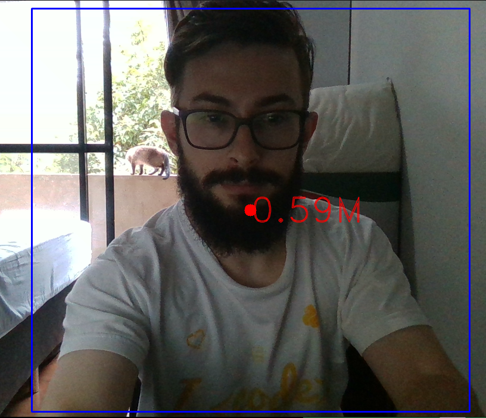

# Real sense python bidings with YOLOv5 integration

 > This is a lightweight implementation of realsense bidings for python from c++. The goal is to use the realsense camera along with some exemples on how to use it in some computer vision projects. 
 
 **Note: Realsense already provide python bidings, but in our experiments they run slower than the ones provided here, and also are more complicated to use**
 
  

It aims to be as simple to use as:

- `from bin.depthcam import DepthCam` 
- `depthcam = DepthCam()`
- `z = depthcam.getDepth(x,y)`

And gets z in millimiters from the x and y pixel positions in the image.

## Installation
### Prerequisites
* A realsense camera.
* Python installed.

